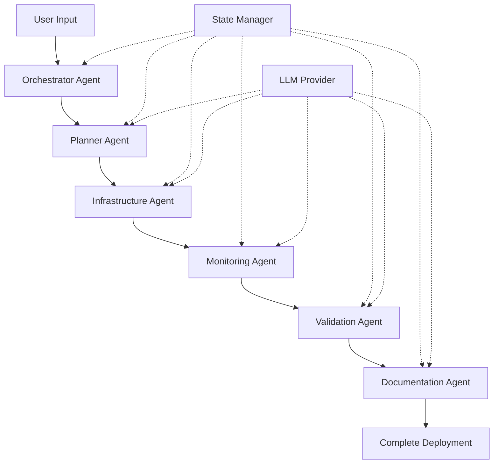

# 🚀 Terraform K8s Agent - Complete Guide

## 📚 Table of Contents

### Main Documentation

1. **[README.md](../README.md)** - Overview and quick start
2. **[QUICKSTART.md](QUICKSTART.md)** - 5-minute quick start
3. **[ARCHITECTURE.md](ARCHITECTURE.md)** - Agent system architecture
4. **[AGENTS.md](AGENTS.md)** - Detailed agent documentation
5. **[CONFIGURATION.md](CONFIGURATION.md)** - All configuration options

### Practical Guides

- **Setup & Installation** → [QUICKSTART.md](QUICKSTART.md)
- **LLM Configuration** → [CONFIGURATION.md#llm-provider](CONFIGURATION.md)
- **K3s Deployment** → [Examples](../examples/k3s-local.yaml)
- **EKS Deployment** → [Examples](../examples/eks-prod.yaml)
- **AKS Deployment** → [Examples](../examples/aks-dev.yaml)
- **Contributing** → [CONTRIBUTING.md](../CONTRIBUTING.md)

---

## 🎯 By Use Case

### I want to... test quickly locally

```bash
# Interactive mode
python main.py

# Or direct
python main.py create --platform k3s --nodes 1 --no-monitoring
```

📖 Read: [QUICKSTART.md](QUICKSTART.md)

### I want to... understand the architecture

The architecture uses 6 specialized agents orchestrated by AI:

```
Orchestrator → Planner → Infrastructure → Monitoring → Validation → Documentation
```

📖 Read: [ARCHITECTURE.md](ARCHITECTURE.md)

### I want to... customize the configuration

Create a YAML file with your config:

```yaml
platform: k3s
environment: development
nodes: 3
monitoring:
  enabled: true
  retention: 15d
```

📖 Read: [CONFIGURATION.md](CONFIGURATION.md)

### I want to... deploy to production (EKS/AKS)

1. Configure cloud credentials
2. Adapt config from `examples/`
3. Launch deployment

📖 Read: [QUICKSTART.md#production](QUICKSTART.md)

### I want to... use a free local LLM

Configure Ollama:

```bash
# Install
curl -fsSL https://ollama.ai/install.sh | sh

# Download a model
ollama pull llama2

# Configure in .env
LLM_PROVIDER=ollama
```

📖 Read: [CONFIGURATION.md#llm-provider](CONFIGURATION.md)

### I want to... contribute

1. Fork the repo
2. Create a branch
3. Develop + tests
4. Pull Request

📖 Read: [CONTRIBUTING.md](../CONTRIBUTING.md)

---

## 🏗️ Architecture Overview

### Multi-Agent System



Each agent:
- ✅ Has a single responsibility
- ✅ Communicates via State Manager
- ✅ Uses AI for optimization
- ✅ Handles errors
- ✅ Logs all actions

📖 Read: [ARCHITECTURE.md](ARCHITECTURE.md)

### Execution Workflow

```
1. PLANNING (Planner Agent)
   ├─ Requirements analysis
   ├─ AI-powered config optimization
   └─ Plan generation

2. PROVISIONING (Infrastructure Agent)
   ├─ Terraform code generation
   ├─ Terraform init/plan/apply
   └─ Output retrieval

3. MONITORING (Monitoring Agent)
   ├─ Prometheus deployment
   ├─ Grafana deployment
   └─ Dashboard import

4. VALIDATION (Validation Agent)
   ├─ Nodes/pods verification
   ├─ Endpoint testing
   └─ Health score

5. DOCUMENTATION (Documentation Agent)
   ├─ README generation
   ├─ Runbook generation
   └─ Configuration export
```

---

## 🤖 Agents in Detail

### 1. Orchestrator Agent

**Role**: Conductor

**Responsibilities**:
- Coordinate all agents
- Manage global workflow
- Decide error handling actions
- Generate final report

📖 Read: [AGENTS.md#orchestrator](AGENTS.md)

### 2. Planner Agent

**Role**: Intelligent Architect

**Responsibilities**:
- Analyze user requirements
- **AI-optimize** configuration
- Generate execution plan
- Estimate resources and time

**AI Usage**: Optimization following K8s best practices

📖 Read: [AGENTS.md#planner](AGENTS.md)

### 3. Infrastructure Agent

**Role**: Provisioner

**Responsibilities**:
- Generate idiomatic Terraform code
- Execute Terraform (init/plan/apply)
- Manage kubeconfig
- Retrieve outputs

**Platforms**: K3s, EKS, AKS (GKE coming soon)

📖 Read: [AGENTS.md#infrastructure](AGENTS.md)

### 4. Monitoring Agent

**Role**: Observability

**Responsibilities**:
- Deploy Prometheus Operator
- Configure Grafana
- Import 5+ dashboards
- Configure alerts

**Stack**: Prometheus + Grafana + ServiceMonitors

📖 Read: [AGENTS.md#monitoring](AGENTS.md)

### 5. Validation Agent

**Role**: Quality Assurance

**Responsibilities**:
- Verify node health
- Validate system pods
- Test monitoring endpoints
- Calculate health score (0-100)

**Output**: Detailed health report

📖 Read: [AGENTS.md#validation](AGENTS.md)

### 6. Documentation Agent

**Role**: Automatic Documentalist

**Responsibilities**:
- Generate complete README
- Create ARCHITECTURE.md
- Create operational RUNBOOK.md
- Create TROUBLESHOOTING guide
- Generate ASCII diagrams

**Output**: Ready-to-use documentation

📖 Read: [AGENTS.md#documentation](AGENTS.md)

---

## ⚙️ Configuration

### Supported LLM Providers

| Provider   | Type    | Cost    | Performance | Privacy |
|------------|---------|---------|-------------|---------|
| OpenAI     | Cloud   | Paid    | ⭐⭐⭐⭐⭐        | ⭐⭐       |
| Anthropic  | Cloud   | Paid    | ⭐⭐⭐⭐⭐        | ⭐⭐⭐      |
| Ollama     | Local   | Free    | ⭐⭐⭐         | ⭐⭐⭐⭐⭐     |

📖 Read: [CONFIGURATION.md#llm-provider](CONFIGURATION.md)

### Kubernetes Platforms

| Platform | Type    | Usage       | Deploy Time  |
|----------|---------|-------------|--------------|
| K3s      | Local   | Dev/Test    | ~5 min       |
| EKS      | AWS     | Production  | ~15-20 min   |
| AKS      | Azure   | Production  | ~10-15 min   |
| GKE      | Google  | Coming soon | TBD          |

📖 Read: [CONFIGURATION.md#platforms](CONFIGURATION.md)

### State Management

| Backend    | Usage           | Multi-instance |
|------------|-----------------|----------------|
| SQLite     | Dev/Test        | ❌              |
| PostgreSQL | Production/Team | ✅              |
| File       | Debug           | ❌              |

📖 Read: [CONFIGURATION.md#state-management](CONFIGURATION.md)

---

## 📊 Monitoring

### Prometheus

**Collected metrics**:
- Kubernetes cluster metrics
- Node metrics (CPU, Memory, Disk, Network)
- Pod metrics
- Container metrics
- Custom app metrics (via ServiceMonitors)

**Access**: http://localhost:9090

### Grafana

**Pre-configured dashboards**:
1. Kubernetes Cluster Monitoring
2. Node Exporter Full
3. Prometheus Stats
4. Pod Monitoring
5. Namespace Resources

**Access**: http://localhost:3000 (admin/admin)

📖 Read: [AGENTS.md#monitoring-agent](AGENTS.md)

---

## 🔒 Security

### Applied Best Practices

✅ **RBAC** enabled by default
✅ **Network Policies** (prod)
✅ **Pod Security Standards** (prod)
✅ **Secrets** managed securely
✅ **Kubeconfig** with 600 permissions
✅ **State** encrypted (PostgreSQL)
✅ **Audit logging** (prod)

📖 Read: [CONFIGURATION.md#security](CONFIGURATION.md)

---

## 🚦 Statuses and Errors

### Workflow Statuses

- `PENDING` - Initialized
- `PLANNING` - Planning in progress
- `PROVISIONING` - Provisioning in progress
- `CONFIGURING` - Monitoring configuration
- `VALIDATING` - Validation
- `DOCUMENTING` - Documentation generation
- `COMPLETED` - ✅ Finished
- `FAILED` - ❌ Failed
- `ROLLED_BACK` - Rollback completed

### Error Handling

**Critical agents** (Planner, Infrastructure):
- Failure → Workflow stop
- Automatic rollback possible

**Non-critical agents** (Monitoring, Documentation):
- Failure → Warning + continuation
- Workflow can complete

📖 Read: [ARCHITECTURE.md#error-handling](ARCHITECTURE.md)

---

## 📈 Performance Metrics

### System KPIs

- **Time to Cluster**: < 10 min (K3s), < 20 min (EKS/AKS)
- **Success Rate**: > 95%
- **Monitoring Coverage**: 100% critical components
- **Documentation**: 100% automatic and up-to-date

### Optimizations

✅ Parallel execution of independent agents
✅ Terraform caching
✅ Pre-pulled Docker images
✅ Incremental updates

---

## 🔄 Roadmap

### Version 0.2

- [ ] Support GKE (Google Cloud)
- [ ] Support Rancher
- [ ] UI Web pour le dashboard
- [ ] Plugin Terraform custom

### Version 0.3

- [ ] GitOps integration (ArgoCD/Flux)
- [ ] Cost optimization agent
- [ ] Security scanning agent
- [ ] Backup & DR agent

### Version 1.0

- [ ] Production ready
- [ ] Multi-cloud orchestration
- [ ] Advanced AI features
- [ ] Enterprise support

---

## 🆘 Support & Aide

### Documentation

| Document | Contenu |
|----------|---------|
| [README.md](../README.md) | Vue d'ensemble |
| [QUICKSTART.md](QUICKSTART.md) | Démarrage rapide |
| [ARCHITECTURE.md](ARCHITECTURE.md) | Architecture système |
| [AGENTS.md](AGENTS.md) | Détail des agents |
| [CONFIGURATION.md](CONFIGURATION.md) | Options de config |
| [CONTRIBUTING.md](../CONTRIBUTING.md) | Guide contribution |

### Common Issues

**LLM not responding** → [QUICKSTART.md#troubleshooting](QUICKSTART.md)
**Terraform errors** → [QUICKSTART.md#troubleshooting](QUICKSTART.md)
**Ports occupied** → [QUICKSTART.md#troubleshooting](QUICKSTART.md)

### Debug

```bash
# Enable detailed logs
DEBUG=true python main.py ...

# Terraform logs
TF_LOG=DEBUG python main.py ...

# System status
python main.py status <workflow-id>
```

---

## 📞 Contact

- **Issues**: GitHub Issues
- **Discussions**: GitHub Discussions
- **Email**: (To be defined)

---

## 📜 License

MIT License - see [LICENSE](../LICENSE)

---

**Created with ❤️ and 🤖 by AI Agents**

*Documentation generated for Terraform K8s Agent v0.1.0*
