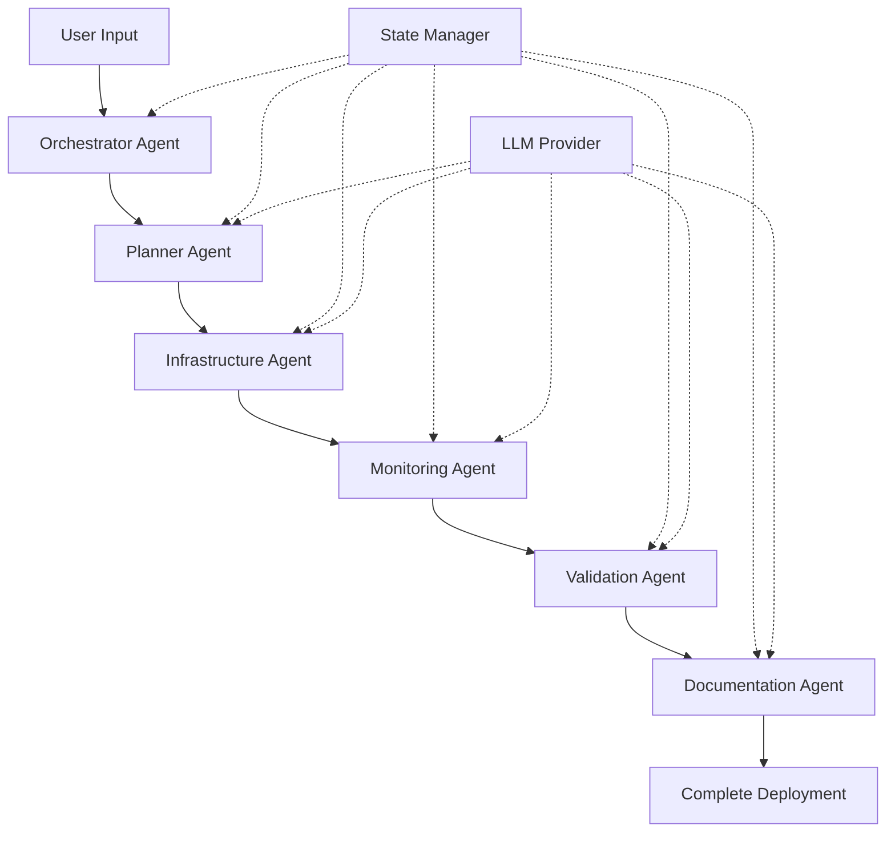

# 🚀 Terraform K8s Agent - Guide Complet

## 📚 Table des Matières

### Documentation Principale

1. **[README.md](../README.md)** - Vue d'ensemble et quick start
2. **[QUICKSTART.md](QUICKSTART.md)** - Démarrage rapide en 5 minutes
3. **[ARCHITECTURE.md](ARCHITECTURE.md)** - Architecture du système agentique
4. **[AGENTS.md](AGENTS.md)** - Documentation détaillée des agents
5. **[CONFIGURATION.md](CONFIGURATION.md)** - Toutes les options de configuration

### Guides Pratiques

- **Setup & Installation** → [QUICKSTART.md](QUICKSTART.md)
- **Configuration LLM** → [CONFIGURATION.md#llm-provider](CONFIGURATION.md)
- **Déploiement K3s** → [Examples](../examples/k3s-local.yaml)
- **Déploiement EKS** → [Examples](../examples/eks-prod.yaml)
- **Déploiement AKS** → [Examples](../examples/aks-dev.yaml)
- **Contribution** → [CONTRIBUTING.md](../CONTRIBUTING.md)

---

## 🎯 Par Cas d'Usage

### Je veux... tester rapidement en local

```bash
# Mode interactif
python main.py

# Ou direct
python main.py create --platform k3s --nodes 1 --no-monitoring
```

📖 Lire : [QUICKSTART.md](QUICKSTART.md)

### Je veux... comprendre l'architecture

L'architecture utilise 6 agents spécialisés orchestrés par l'IA :

```
Orchestrator → Planner → Infrastructure → Monitoring → Validation → Documentation
```

📖 Lire : [ARCHITECTURE.md](ARCHITECTURE.md)

### Je veux... personnaliser la configuration

Créer un fichier YAML avec votre config :

```yaml
platform: k3s
environment: development
nodes: 3
monitoring:
  enabled: true
  retention: 15d
```

📖 Lire : [CONFIGURATION.md](CONFIGURATION.md)

### Je veux... déployer en production (EKS/AKS)

1. Configurer les credentials cloud
2. Adapter la config depuis `examples/`
3. Lancer le déploiement

📖 Lire : [QUICKSTART.md#production](QUICKSTART.md)

### Je veux... utiliser un LLM local gratuit

Configurer Ollama :

```bash
# Installer
curl -fsSL https://ollama.ai/install.sh | sh

# Télécharger un modèle
ollama pull llama2

# Configurer dans .env
LLM_PROVIDER=ollama
```

📖 Lire : [CONFIGURATION.md#llm-provider](CONFIGURATION.md)

### Je veux... contribuer

1. Fork le repo
2. Créer une branche
3. Développer + tests
4. Pull Request

📖 Lire : [CONTRIBUTING.md](../CONTRIBUTING.md)

---

## 🏗️ Architecture en Bref

### Système Multi-Agents



Chaque agent :
- ✅ A une responsabilité unique
- ✅ Communique via le State Manager
- ✅ Utilise l'IA pour optimiser
- ✅ Gère les erreurs
- ✅ Log toutes les actions

📖 Lire : [ARCHITECTURE.md](ARCHITECTURE.md)

### Workflow d'Exécution

```
1. PLANNING (Planner Agent)
   ├─ Analyse des requirements
   ├─ Optimisation IA de la config
   └─ Génération du plan

2. PROVISIONING (Infrastructure Agent)
   ├─ Génération code Terraform
   ├─ Terraform init/plan/apply
   └─ Récupération outputs

3. MONITORING (Monitoring Agent)
   ├─ Déploiement Prometheus
   ├─ Déploiement Grafana
   └─ Import dashboards

4. VALIDATION (Validation Agent)
   ├─ Vérification nodes/pods
   ├─ Test endpoints
   └─ Health score

5. DOCUMENTATION (Documentation Agent)
   ├─ Génération README
   ├─ Génération Runbook
   └─ Export configurations
```

---

## 🤖 Les Agents en Détail

### 1. Orchestrator Agent

**Rôle** : Chef d'orchestre

**Responsabilités** :
- Coordonner tous les agents
- Gérer le workflow global
- Décider des actions en cas d'erreur
- Générer le rapport final

📖 Lire : [AGENTS.md#orchestrator](AGENTS.md)

### 2. Planner Agent

**Rôle** : Architecte intelligent

**Responsabilités** :
- Analyser les besoins utilisateur
- **Optimiser via IA** la configuration
- Générer le plan d'exécution
- Estimer ressources et temps

**IA Usage** : Optimisation selon best practices K8s

📖 Lire : [AGENTS.md#planner](AGENTS.md)

### 3. Infrastructure Agent

**Rôle** : Provisionneur

**Responsabilités** :
- Générer code Terraform idiomatique
- Exécuter Terraform (init/plan/apply)
- Gérer le kubeconfig
- Récupérer les outputs

**Plateformes** : K3s, EKS, AKS (GKE à venir)

📖 Lire : [AGENTS.md#infrastructure](AGENTS.md)

### 4. Monitoring Agent

**Rôle** : Observabilité

**Responsabilités** :
- Déployer Prometheus Operator
- Configurer Grafana
- Importer 5+ dashboards
- Configurer les alertes

**Stack** : Prometheus + Grafana + ServiceMonitors

📖 Lire : [AGENTS.md#monitoring](AGENTS.md)

### 5. Validation Agent

**Rôle** : Quality Assurance

**Responsabilités** :
- Vérifier santé des nodes
- Valider les pods système
- Tester les endpoints monitoring
- Calculer health score (0-100)

**Output** : Rapport de santé détaillé

📖 Lire : [AGENTS.md#validation](AGENTS.md)

### 6. Documentation Agent

**Rôle** : Documentaliste automatique

**Responsabilités** :
- Générer README complet
- Créer ARCHITECTURE.md
- Créer RUNBOOK.md opérationnel
- Créer guide TROUBLESHOOTING
- Générer diagrammes ASCII

**Output** : Documentation prête à l'emploi

📖 Lire : [AGENTS.md#documentation](AGENTS.md)

---

## ⚙️ Configuration

### Providers LLM Supportés

| Provider   | Type    | Coût    | Performance | Privacy |
|------------|---------|---------|-------------|---------|
| OpenAI     | Cloud   | Payant  | ⭐⭐⭐⭐⭐        | ⭐⭐       |
| Anthropic  | Cloud   | Payant  | ⭐⭐⭐⭐⭐        | ⭐⭐⭐      |
| Ollama     | Local   | Gratuit | ⭐⭐⭐         | ⭐⭐⭐⭐⭐     |

📖 Lire : [CONFIGURATION.md#llm-provider](CONFIGURATION.md)

### Plateformes Kubernetes

| Platform | Type    | Usage       | Temps Deploy |
|----------|---------|-------------|--------------|
| K3s      | Local   | Dev/Test    | ~5 min       |
| EKS      | AWS     | Production  | ~15-20 min   |
| AKS      | Azure   | Production  | ~10-15 min   |
| GKE      | Google  | Coming soon | TBD          |

📖 Lire : [CONFIGURATION.md#platforms](CONFIGURATION.md)

### State Management

| Backend    | Usage           | Multi-instance |
|------------|-----------------|----------------|
| SQLite     | Dev/Test        | ❌              |
| PostgreSQL | Production/Team | ✅              |
| File       | Debug           | ❌              |

📖 Lire : [CONFIGURATION.md#state-management](CONFIGURATION.md)

---

## 📊 Monitoring

### Prometheus

**Métriques collectées** :
- Kubernetes cluster metrics
- Node metrics (CPU, Memory, Disk, Network)
- Pod metrics
- Container metrics
- Custom app metrics (via ServiceMonitors)

**Accès** : http://localhost:9090

### Grafana

**Dashboards pré-configurés** :
1. Kubernetes Cluster Monitoring
2. Node Exporter Full
3. Prometheus Stats
4. Pod Monitoring
5. Namespace Resources

**Accès** : http://localhost:3000 (admin/admin)

📖 Lire : [AGENTS.md#monitoring-agent](AGENTS.md)

---

## 🔒 Sécurité

### Best Practices Appliquées

✅ **RBAC** activé par défaut
✅ **Network Policies** (prod)
✅ **Pod Security Standards** (prod)
✅ **Secrets** gérés de manière sécurisée
✅ **Kubeconfig** avec permissions 600
✅ **State** chiffré (PostgreSQL)
✅ **Audit logging** (prod)

📖 Lire : [CONFIGURATION.md#security](CONFIGURATION.md)

---

## 🚦 Statuts et Erreurs

### Workflow Statuses

- `PENDING` - Initialisé
- `PLANNING` - En planification
- `PROVISIONING` - Provisioning en cours
- `CONFIGURING` - Configuration monitoring
- `VALIDATING` - Validation
- `DOCUMENTING` - Génération doc
- `COMPLETED` - ✅ Terminé
- `FAILED` - ❌ Échec
- `ROLLED_BACK` - Rollback effectué

### Gestion des Erreurs

**Agents critiques** (Planner, Infrastructure) :
- Échec → Arrêt du workflow
- Rollback automatique possible

**Agents non-critiques** (Monitoring, Documentation) :
- Échec → Warning + continuation
- Workflow peut se terminer

📖 Lire : [ARCHITECTURE.md#error-handling](ARCHITECTURE.md)

---

## 📈 Métriques de Performance

### KPIs Système

- **Time to Cluster** : < 10 min (K3s), < 20 min (EKS/AKS)
- **Success Rate** : > 95%
- **Monitoring Coverage** : 100% composants critiques
- **Documentation** : 100% automatique et à jour

### Optimisations

✅ Exécution parallèle des agents indépendants
✅ Caching Terraform
✅ Images Docker pré-pullées
✅ Incremental updates

---

## 🔄 Roadmap

### Version 0.2

- [ ] Support GKE (Google Cloud)
- [ ] Support Rancher
- [ ] UI Web pour le dashboard
- [ ] Plugin Terraform custom

### Version 0.3

- [ ] GitOps integration (ArgoCD/Flux)
- [ ] Cost optimization agent
- [ ] Security scanning agent
- [ ] Backup & DR agent

### Version 1.0

- [ ] Production ready
- [ ] Multi-cloud orchestration
- [ ] Advanced AI features
- [ ] Enterprise support

---

## 🆘 Support & Aide

### Documentation

| Document | Contenu |
|----------|---------|
| [README.md](../README.md) | Vue d'ensemble |
| [QUICKSTART.md](QUICKSTART.md) | Démarrage rapide |
| [ARCHITECTURE.md](ARCHITECTURE.md) | Architecture système |
| [AGENTS.md](AGENTS.md) | Détail des agents |
| [CONFIGURATION.md](CONFIGURATION.md) | Options de config |
| [CONTRIBUTING.md](../CONTRIBUTING.md) | Guide contribution |

### Problèmes Courants

**LLM ne répond pas** → [QUICKSTART.md#troubleshooting](QUICKSTART.md)
**Terraform errors** → [QUICKSTART.md#troubleshooting](QUICKSTART.md)
**Ports occupés** → [QUICKSTART.md#troubleshooting](QUICKSTART.md)

### Debug

```bash
# Activer logs détaillés
DEBUG=true python main.py ...

# Logs Terraform
TF_LOG=DEBUG python main.py ...

# État du système
python main.py status <workflow-id>
```

---

## 📞 Contact

- **Issues** : GitHub Issues
- **Discussions** : GitHub Discussions
- **Email** : (À définir)

---

## 📜 License

MIT License - voir [LICENSE](../LICENSE)

---

**Créé avec ❤️ et 🤖 par des Agents IA**

*Documentation générée pour Terraform K8s Agent v0.1.0*
